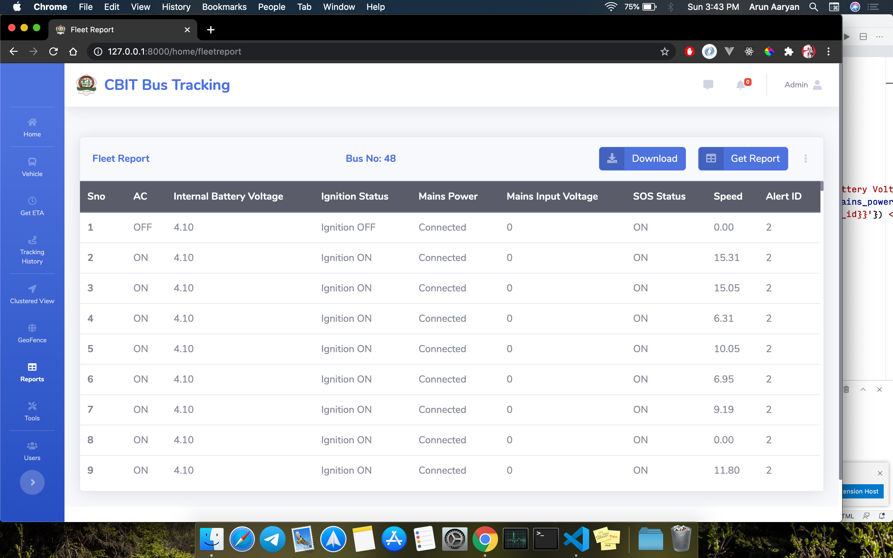
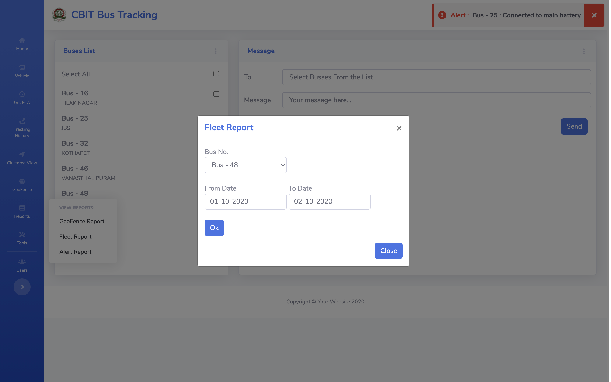
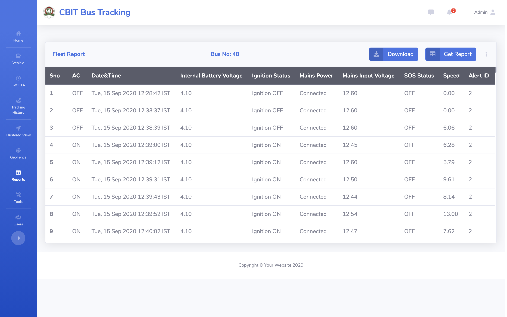
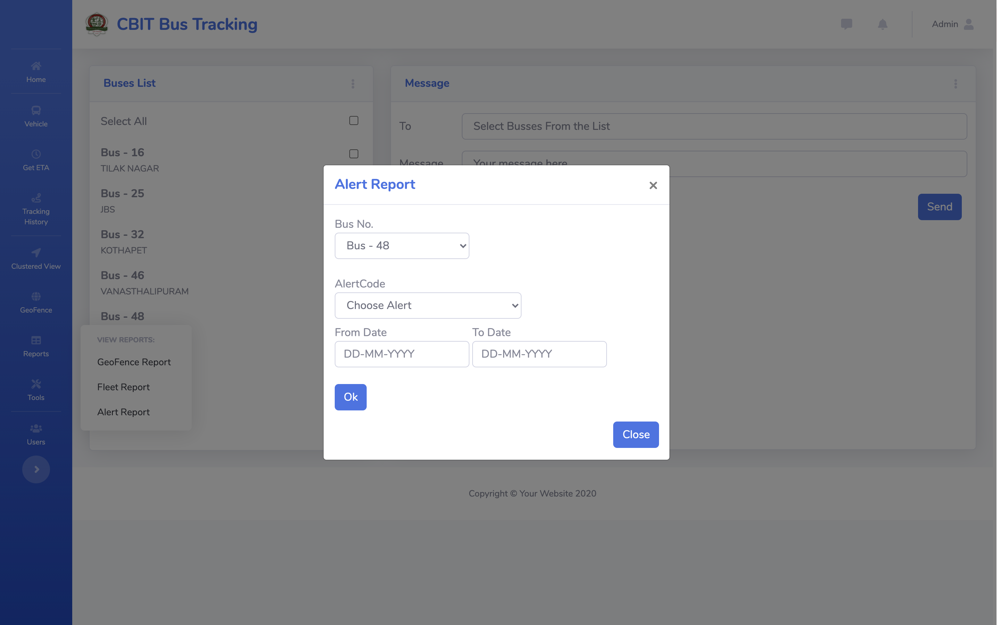
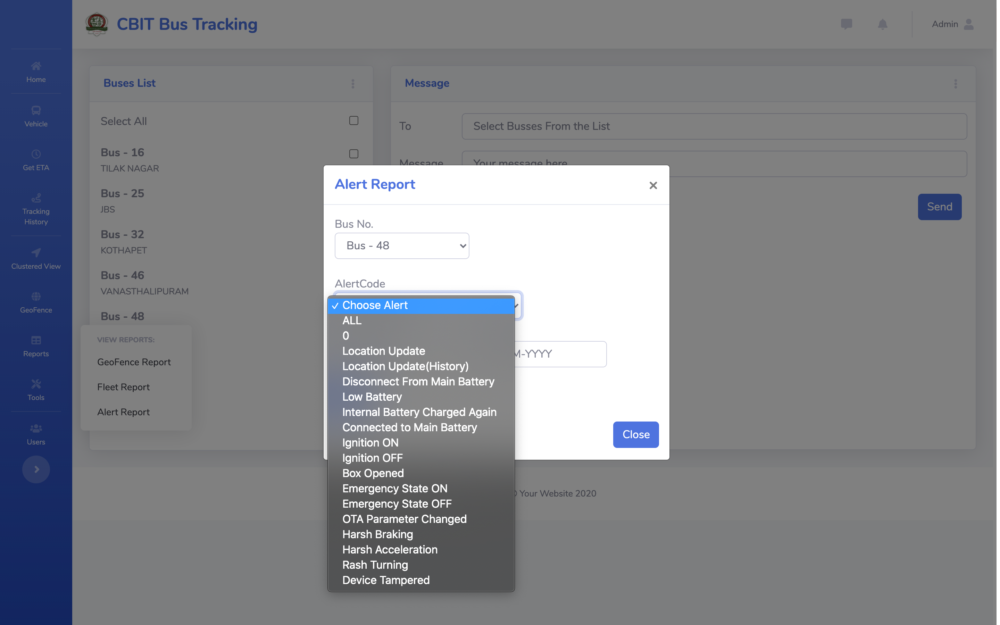
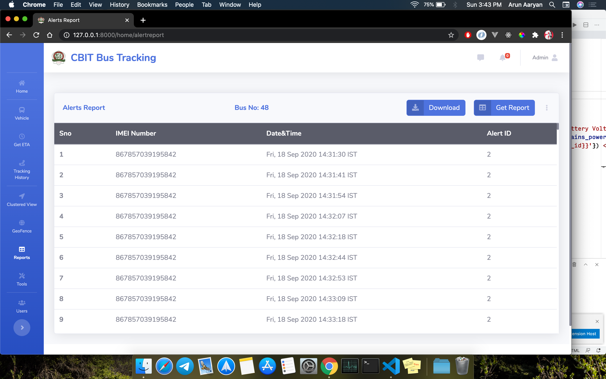

# This Project is a part of Internship.
# I do not entitle the rights to the whole project as it is contributed by other team members.
# I have added screens only for the Work I have done.

* Data is fetched from flask api
* Error Handling is done on Client Side i.e. in this screens 
* Pagination is handled
* Datatables are used to show data
* 
## FleetReports 

# AlertReports

